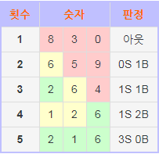

<h1>숫자 야구게임</h1>

<h2>게임 요구 조건</h2>

 <ul>
 	<li>사용되는 숫자는 0 에서 9까지 서로 다른 숫자이다. </li>
 	<li>숫자는 맞지만 위치가 틀렸을 때는 볼.</li>
 	<li>숫자와 위치가 전부 맞으면 스트라이크. </li>
 	<li>숫자와 위치가 전부 틀리면 아웃.</li>
 </ul>
 
 
 
ex : answer is "216"

 
해설

 <ol>
 
  <li>
   830 - 들어맞은 숫자가 아예 없으므로 아웃
  </li>
  
  <li>
   659 - <b>6</b>이 있지만 위치가 다르므로 <b>1</b>볼 
  </li>
  
  <li>
    264 - <b>2</b> 가 있고 <b>6</b>치가 맞으며, <b>6</b>이 있지만 위치가 다르므로 <b>1</b>스트라이크 <b>1</b>볼
  </li>
  
  <li>
    126 - 숫자는 전부 맞지만 위치는 <b>6</b>만 맞고 나머지 둘은 다르므로 <b>1</b>스트라이크 <b>2</b>볼
  </li>
  
  <li>
    216 - 전부 맞으므로 승리!
  </li>
</ol>

출처 : <a href="https://namu.wiki/w/%EC%88%AB%EC%9E%90%EC%95%BC%EA%B5%AC">나무위키</a>

<h2> 프로그래밍 요구 사항</h2>
     <ul>
         <li>
             자바 코드 컨벤션을 지키면서 프로그래밍한다.
         </li>
         <li>
             indent(인덴트, 들여쓰기) depth를 3이 넘지 않도록 구현한다. 2까지만 허용한다.
              - 예를 들어 while문 안에 if문이 있으면 들여쓰기는 2이다.
              - 힌트 : indent(인덴트, 들여쓰기) depth를 줄이는 좋은 방법은 함수(또는 메소드)를 분리하면 된다.
         </li>
         <li>
             함수 (또는 메소드)가 한 가지 일만 하도록 최대한 작게 만들어라.
         </li>
     </ul>

출처 : 우아한 테크 코스1기 - 프리코스 1주차 요구사항

<h2> 프로그램 정보</h2>

  <ul>
      <li>
                  class : computer 
              -> method : insertRandomNumber
              -> method : numberSet(int number)  
      </li>
      <li>
                  class : User 
              -> method : insertNumber
              -> method : numberSet(int number)  
      </li>
      
  </ul>